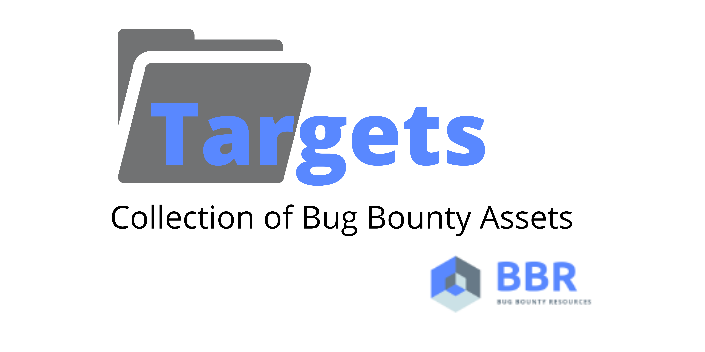

# 📂 Public Bug Bounty Targets Data
---
By [**BugBountyResources**](https://github.com/BugBountyResources)



A collection of over **5.1M sub-domains and assets** belonging to bug bounty targets, all put in a single file (using a [script](https://github.com/BugBountyResources/targets/blob/main/targets_extract.py) ).

Goal of this repo is to track changes in targets and add/remove new/old targets, in order to perform reconnaissance en-masse, by putting them all in one place.
Collecting all sub-domains at one place can make certain bulk operations like bulk vulnerability testing by fingerprinting easy, all at once!

Also, it is supposed to work as a **mirror** of the [ProjectDiscovery's public bug bounty assets recon data](https://chaos.projectdiscovery.io).

## ⚒️ Workflow
  - Extract target data from [Chaos](https://chaos.projectdiscovery.io/), using the [targets_extract.py script](https://github.com/BugBountyResources/targets/blob/main/targets_extract.py)
  - Push data to GitHub

## ⚙️ Install & Usage
```
root@bug-bounty:~/recon/assets# ./targets_extract.py -h
usage: targets_extract.py [-h] [-d DIRECTORY] [-o OUTPUT] [-c PROCESSES]

If needed, specify output directory or, file name. Example:
./targets_extract.py -o assets.txt to store to ./output/assets.txt, optionally
specify directory (./targets_extract.py -d mydir). Also, you can increase
number of processes with -c flag to make it even faster.

optional arguments:
  -h, --help            show this help message and exit
  -d DIRECTORY, --directory DIRECTORY
                        Specify an output directory [Default: ./output]
  -o OUTPUT, --output OUTPUT
                        Specify an output file name [Default: all.txt]
  -c PROCESSES, --processes PROCESSES
                        Specify number of processes for faster extraction
                        [Default: 30]
  ```
  - Clone the repo: ```git clone https://github.com/BugBountyResources/targets.git```
  - Navigate into the repo using: ```cd targets```
  - Give execute permissions to script: ```chmod +x targets_extract.py```
  - Run script: ```./targets_extract.py```
  
  ### 🛠️ Further Customize
  - If you want to add more processes (for download & zip extraction), use the `-c` flag - `./targets_extract.py -c 60`
  - If you want to output to custom file (saved to `output/all.txt` by default), you can specify the file name in `-o` flag - `./targets_extract.py -o custom.txt`
  - If you want to store output in custom folder add an addition `-d` flag - `./targets_extract.py -d custom_directory`

## 📊 Stats
---

| File                 | Number of Assets     |
|---------------------- | --------------------------|
| [Download Part 1](https://github.com/BugBountyResources/targets/raw/main/all_0.txt)       | **2.55M**  (2,556,493)             |
| [Download Part 2](https://github.com/BugBountyResources/targets/raw/main/all_1.txt)       | **2.55M**   (2,556,493)            |

Total collected: **5.1M assets** (5,112,986 assets)


## ℹ️ Source of Data
---
Data collected from [ProjectDiscovery's Chaos Project](https://chaos.projectdiscovery.io/).

### 🙌 Credits
---
  - [**Arif Khan**](https://twitter.com/payloadartist) - conceived the idea of collecting all the data in one place, created the project and wrote the [extraction script](https://github.com/BugBountyResources/targets/blob/main/targets_extract.py). Also part of the [**BugBountyResources** team](https://github.com/BugBountyResources)

  - [**ProjectDiscovery Team (Chaos)**](https://twitter.com/pdchaos) - They own and made available this data! Massive thanks to the whole [ProjectDiscovery Team](https://projectdiscovery.io) for sharing updated reconnaissance data of Public Bug Bounty programs. 
  
  - [**Aryan Rupala**](https://twitter.com/aryan_2808) - Part of the [**BugBountyResources** team](https://github.com/BugBountyResources), who helps track down issues, shares ideas and also writes code.
  
  - [**PR3R00T**](https://twitter.com/Pr3R00T) - Gave useful insights, cleaned code, improved docs by adding Installation instructions and made an improvement for filtering out duplicates.

  - [**You?**](https://github.com/BugBountyResources/targets/pulls) - Contribute to the project, and you can be featured here in the [**Credits**](https://github.com/BugBountyResources/targets/blob/main/README.md#-credits) section!
